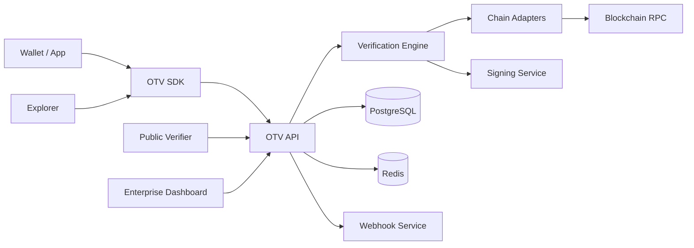
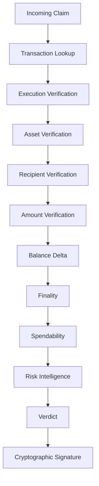

# Architecture — OpenTrust Verify

## System context

## Verification pipeline

## Monorepo layout

See root `README.md`. Apps consume packages; services own runtime; database owns schema.

## Trust boundary

Clients never receive signing keys. Verdicts are signed server-side. Signature verification is public.

## Tenancy

`organizations` → `projects` → `api_keys` / `webhooks` / usage. Row-level tenant filters in queries.
